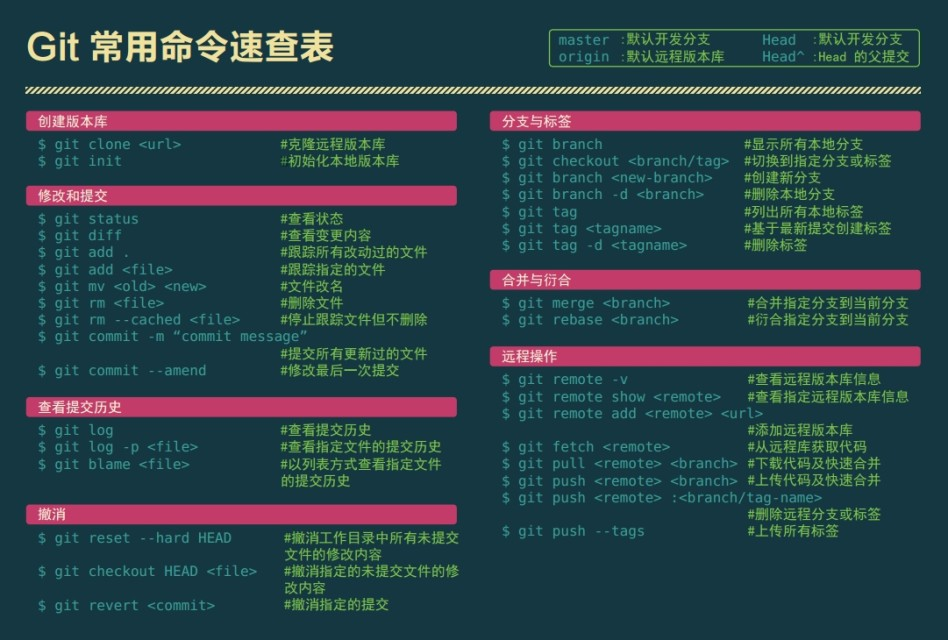

### git使用流程

#### 克隆远程版本库
```
git clone https://github.com/NickIsACoder/justForTest.git
```

#### 拉取最新版本
```JavaScript
git pull
```

#### 提交代码
```JavaScript
git add . 
git commit -m '提交修改'
git push
// 或者
git push origin test
```

#### 分支
``` JavaScript
// 查看分支
git branch

// 查看远程分支
git branch -r

// 创建本地分支
git branch test

// 提交本地分支到远程
// 1、远程已有test分支且已经关联本地test分支，且本地已切换到分支test
git push
// 2、远程已有test分支但未关联本地分支test，且本地已切换到分支test
git push -u origin/test   // origin/test表示远程的test分支
// 3、远程没有test分支，且本地已切换到分支test
git push origin test:test  // :号前面未本地分支名称，后面为远端分支名称(没有会自动创建)


// 切换分支
git checkout test

// 删除本地分支
git branch -d test
// 注：删除分支时如果出现错误error：The 'test' is not fully merged
//  意思为test分支还没有被合并，如果删除，将会丢失修改。需使用强制删除
git branch -D test // 强制删除分支

// 删除远程分支
git push origin -d test 

// 把test分支合并到当前分支
git merge test  
// 
```


#### 其他
```JavaScript
// 查看状态
git status

// 查看日志
git log

git show HEAD // 查看最后一次提交修改的详细信息 也可以用git show 哈希值 查看对应的内容
git show HEAD^ // 查看倒数第二次的提交修改详细信息

git diff // 查看变更 工作区与暂存区的差异比对
git diff --cached // 暂存区与提交版本的差异
git diff HEAD // 工作区与仓库中最后一次提交版本的差别


git config --list // 获取config信息
```

#### 标签
```JavaScript
// 查看列出所有打过的标签名
git tag

// 删除对应标签
git tag -d 标签名 

// 在当前仓库打个标签
git tag 标签名字 
```

